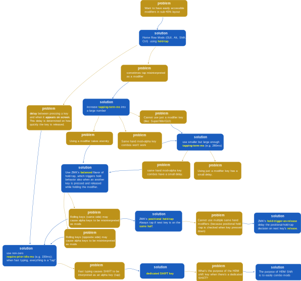

# Home Row Mods on ZMK

This is a summary of the current state of the art configuration for HRMs on ZMK, and contains in essence urob's findings from [urob/zmk-config](https://github.com/urob/zmk-config) with a few very minor additions. For more detailed explanations, refer to the urob/zmk-config.

## Summary

If you want to use Home Row Mods (HRMs) on ZMK, the **working settings are**:

- Use the "balanced" flavor of hold-tap (make modifiers instant)
- Use the positional hold-tap (prevent false positives)
- Use a dedicated Shift key (and possibly no Shift in HRM. Idea taken from Ben Vallack's layout [here](https://youtu.be/8wZ8FRwOzhU?si=O6Qf5u7mmEiW8d8N&t=138))
- `tapping-term-ms` around 280ms
- `require-prior-idle-ms` around 150ms

In the end, your **setup has the following properties**:
- When typing fast (34 WPM+), no keys have delay and all key presses are interpreted as taps (alphas)
- Modifiers work only with the keys on the opposite side; there should be no false positive modifier hits
- Using _just_ a modifier key has a small (tapping-term-ms) delay
- Any other use of modifiers should have zero delay

